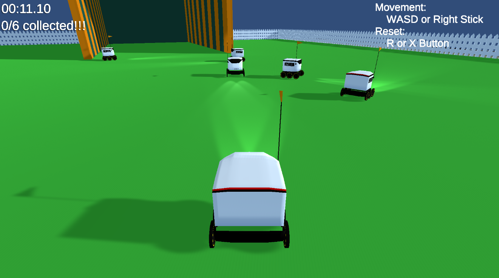
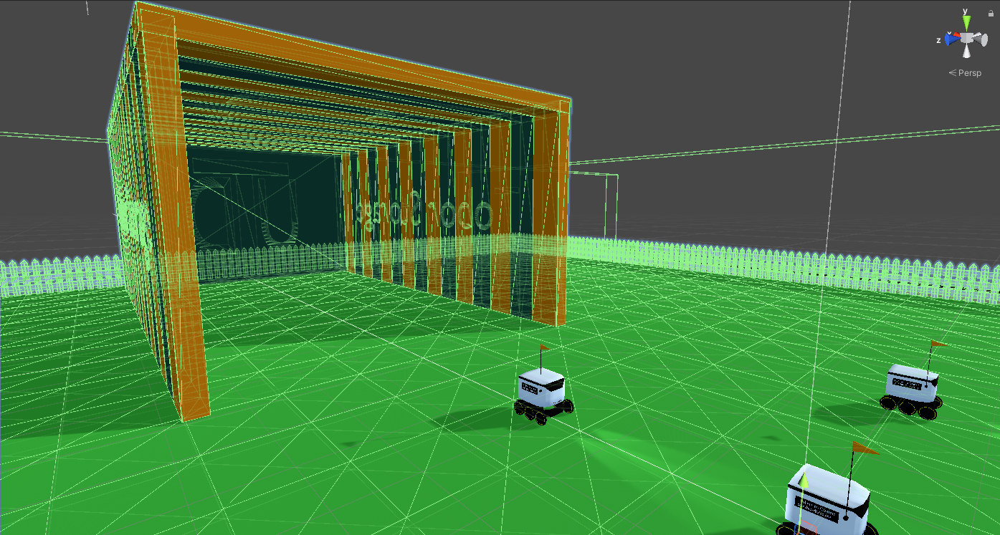
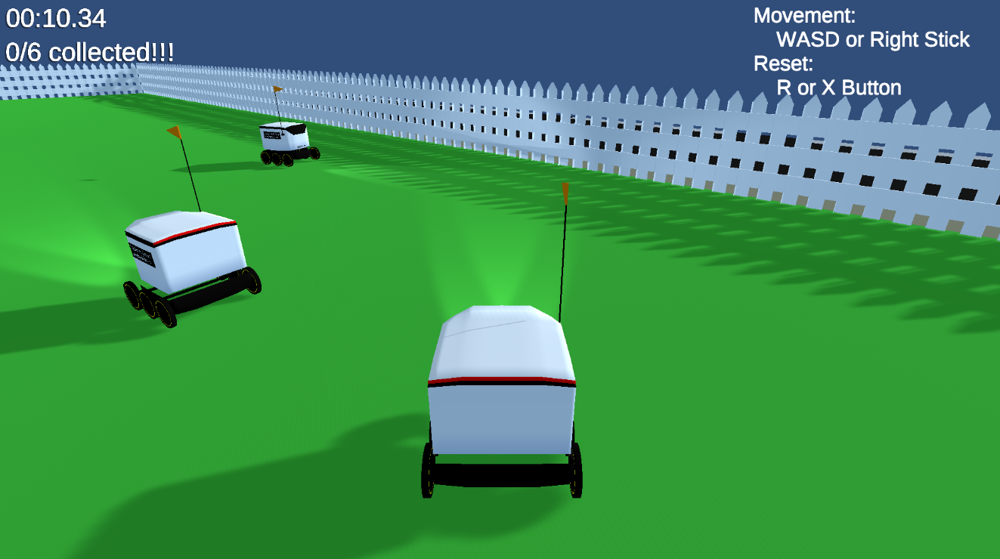
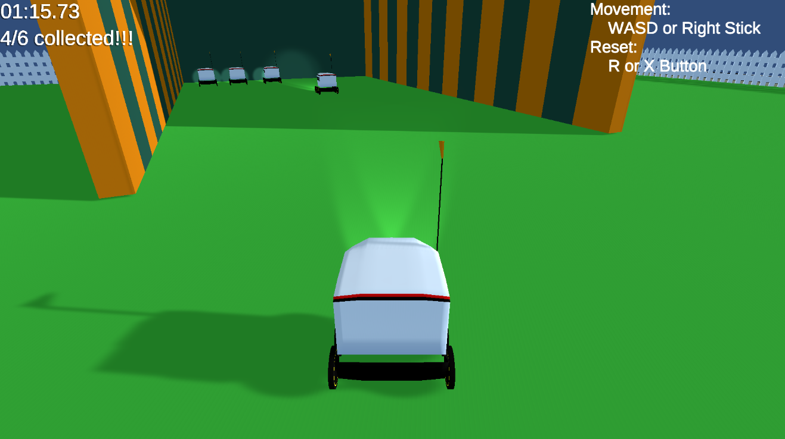

# Tobor Herding (CS4361-Project)

## About

Tobor herding game made in Unity by Arsenios Scrivens, Vedansh Patel, Hogan Steffes, and Jonathan Moore.
Title screen image by [OmegaPy](https://www.reddit.com/r/utdallas/comments/e6ssck/these_are_the_droids_youre_looking_for/).

The objective of the game is to herd all the other Tobors (UTD delivery robots) into the parking garage as quickly as possible.

## Demo

A live WebGL demo of the game is available [here](https://jmoore34.github.io/ToborHerding/).

## Screenshots

